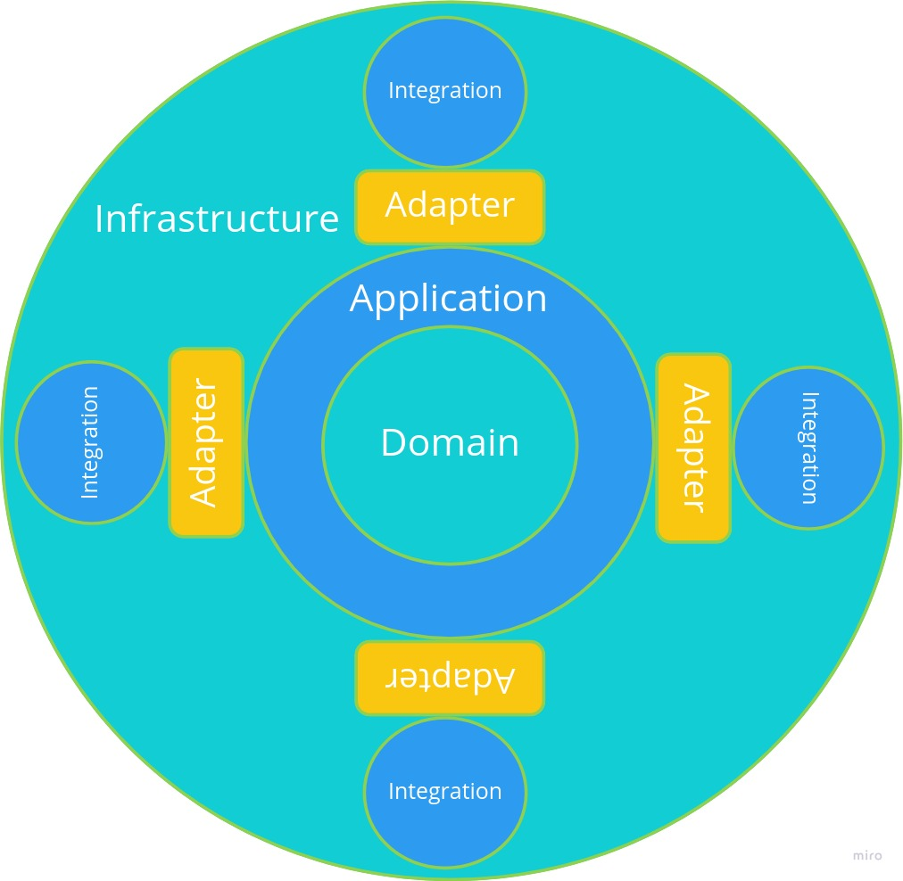
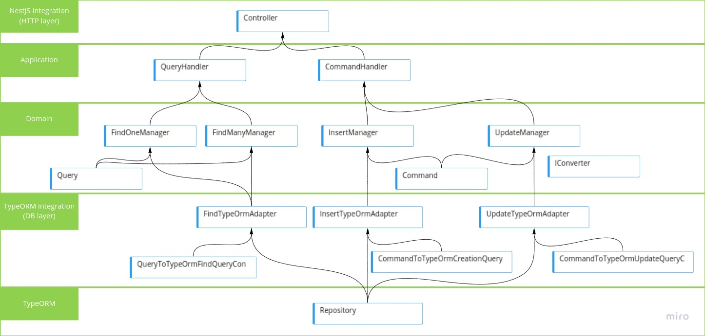

# Architecture

The project architecture is based on DDD.

## DDD overview

**Note** layer descriptions have been adapted from https://ademcatamak.medium.com/layers-in-ddd-projects-bd492aa2b8aa

### Application layer

It is the layer where business process flows are handled. The capabilities of the application can be observed in this layer. `CQRS` pattern is used to implement this layer

### Domain layer

This will be the core of the application. It is the layer where all business rules are included. This layer should be kept away from dependencies as much as possible. Third party libraries should not be added as much as possible, as it should not take other layers as a reference.

### Infrastructure layer

This layer will be the layer that accesses external services such as database, messaging systems and email services. Modules in this layer often implements contracts established at the domain layer

## REST API flow

This project is mainly a REST API. A more detailed flow is included to describe the flow starting in the HTTP layer until the database layer

### Application layer common pieces
- **Commands**: Represents a write operation at application layer. Located at `src/[module]/application/command/`.
- **Queries**: Represents a read operation at application layer. Located at `src/[module]/application/query/`.
- **Command handlers**: handles `commands` and returns the result of the `command` execution. Located at `src/[module]/application/handler/`.
- **Query handlers**: handles `queries` and returns the result of the `query` execution. Located at `src/[module]/application/handler/`.

### Domain layer common pieces
- **Managers**: Represents modules with business logic. They do have a single responsability. Located at `src/[module]/domain/service/`.
- **Models**: Represents entities or value objects of the business logic. Located at `src/[module]/domain/model/`.
- **Commands**: Represents a write operation at domain layer. Located at `src/[module]/domain/command/`.
- **Queries**: Represents a read operation at domain layer. Located at `src/[module]/domain/query/`.
- **Service interfaces**: Consider `Converter` interface as an example. This modules establish a contract to be implemented at infrastructure layer. Located at `src/[module]/domain/service/`.
- **Adapter interfaces**: Consider `InsertAdapter` interface as an example. This modules establish a contract to be implemented at infrastructure layer in order to establish a bridge between `domain` and `infrastructure` layers. Located at `src/[module]/domain/adapter/`.

### Integration layer common pieces

- **Adapter implementations**: implements a domain's `adapter` contract. Located at `src/[module]/integration/[integration-layer]/adapter/`.
- **Converter implementations**: converts a `command`, `query` or `model` into its equivalent representation in the infrastructure layer. Located at `src/[module]/integration/[integration-layer]/service/`.
- **Controllers**: HTTP layer is designed as an additional integration so NestJS `controllers`
are included here. Located at `src/[module]/integration/http/controller/`
- **Models**: Represents entities or value objects at the layer. Located at `src/[module]/integration/[integration-layer]/model/`.
- **Modules**: Represents a `NestJS` [module](https://docs.nestjs.com/modules). Located at `src/[module]/integration/injection/`
